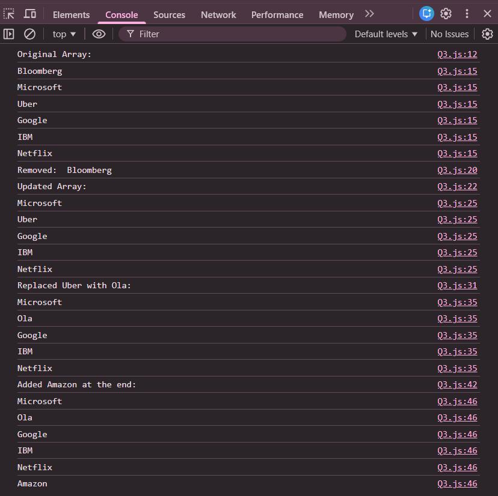

# Practice Question – Array Operations on Company Names

This repository contains a simple JavaScript program that performs **basic array operations** on a list of company names.  
It is intended for beginners to practice **array methods** and understand how arrays can be modified dynamically.

---

## 📌 Program Overview

The program starts with an array of company names and performs the following operations step by step:
1. Removes the first company from the array
2. Replaces `"Uber"` with `"Ola"`
3. Adds `"Amazon"` to the end of the array

After each operation, the updated array is printed in the browser console.

---

## 🧪 Code Functionality

- Creates an array of company names
- Prints the original array
- Removes the first element using `shift()`
- Replaces an element using `splice()`
- Adds a new element at the end using `push()`
- Displays array contents after each modification using `console.log()`

---

## 🧠 Concepts Covered

- Arrays in JavaScript
- `shift()` method
- `splice()` method
- `push()` method
- Iterating over arrays using `for-of`
- Console output using `console.log()`

---

## 🖥️ Output

📸 **Output showing array updates after each operation:**  

---

## 📂 File Information

- `index.html` — HTML file used to run JavaScript in the browser  
- `array_operations.js` — JavaScript file containing the logic  
- `output.png` — Screenshot of the console output  
- `README.md` — Project documentation  

---

## ⚠️ Limitations
- Company names are hardcoded
- Operations are fixed and sequential
- No user input
- Output is visible only in the browser console  

---

## 👨‍💻 Author

**Shreya Awari**  
📧 Email: shreyaawari31@gmail.com  
🌐 GitHub: https://github.com/shreyaawari28  

---

⭐ Feel free to **star the repository** if you find it useful.

