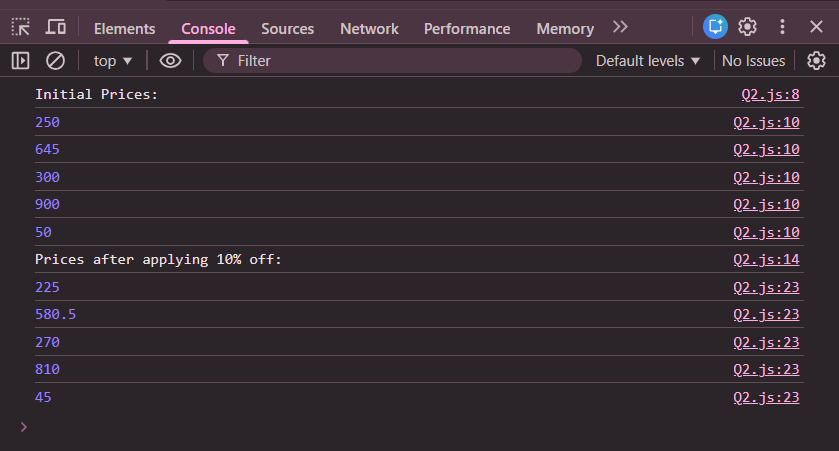

# Practice Question – Apply Discount on Item Prices

This repository contains a simple JavaScript program that applies a **10% discount** to a list of item prices stored in an array.  
It is intended for beginners to practice **arrays**, **loops**, and **basic arithmetic operations** in JavaScript.

---

## 📌 Program Overview

The program stores prices of multiple items in an array and applies a 10% discount to each item.  
The discounted prices replace the original prices in the same array.

Both the original prices and the final prices after applying the discount are displayed in the browser console.

---

## 🧪 Code Functionality

- Stores item prices in an array
- Prints the original prices
- Calculates a 10% discount for each item
- Updates the array with discounted prices
- Prints the updated prices after applying the offer
- Displays all outputs using `console.log()`

---

## 🧠 Concepts Covered

- Arrays in JavaScript
- `for-of` loop
- Array index manipulation
- Arithmetic operations
- Updating array values
- Console output using `console.log()`

---

## 🖥️ Output

📸 **Output showing original prices and prices after applying 10% discount:**  

---

## 📂 File Information

- `index.html` — HTML file used to run JavaScript in the browser  
- `discount.js` — JavaScript file containing the logic  
- `output.png` — Screenshot of the console output  
- `README.md` — Project documentation  

---

## ⚠️ Limitations
- Prices are hardcoded
- Discount percentage is fixed (10%)
- No user input
- Output is visible only in the browser console  

---

## 👨‍💻 Author

**Shreya Awari**  
📧 Email: shreyaawari31@gmail.com  
🌐 GitHub: https://github.com/shreyaawari28  

---

⭐ Feel free to **star the repository** if you find it useful.

