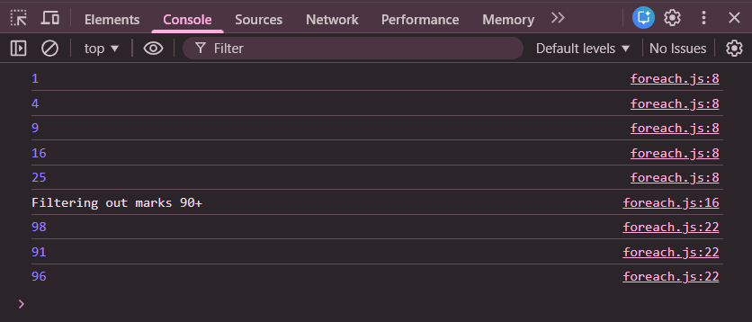

# Practice Question – reduce() Array Method

This repository contains JavaScript programs that demonstrate the use of the **`reduce()` array method**.  
It is intended for beginners to understand how an array can be **reduced to a single value** using JavaScript.

---

## 📌 Program Overview

The program demonstrates two common use cases of the `reduce()` method:

1. Calculating the **sum of all elements** in an array  
2. Finding the **greatest number** from an array  

The `reduce()` method iterates through the array and accumulates values based on the logic provided in the callback function.

---

## 🧪 Code Functionality

- Uses `reduce()` to calculate the sum of numbers in an array
- Uses `reduce()` with a conditional expression to find the maximum value
- Uses `forEach()` to display array elements before reduction
- Displays final results using `console.log()`

---

## 🧠 Concepts Covered

- Arrays in JavaScript
- `reduce()` array method
- Accumulator (`prev`) and current value (`curr`)
- Conditional (ternary) operator
- Arrow functions
- Console output using `console.log()`

---

## 🖥️ Output

📸 **Output showing sum of array elements and greatest number:**  

---

## 📂 File Information

- `index.html` — HTML file used to run JavaScript in the browser  
- `reduce_example.js` — JavaScript file containing `reduce()` examples  
- `output.png` — Screenshot of the console output  
- `README.md` — Project documentation  

---

## ⚠️ Limitations
- Arrays are hardcoded
- No user input
- Output is visible only in the browser console  

---

## 👨‍💻 Author

**Shreya Awari**  
📧 Email: shreyaawari31@gmail.com  
🌐 GitHub: https://github.com/shreyaawari28  

---

⭐ Feel free to **star the repository** if you find it useful.

