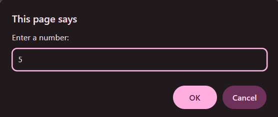
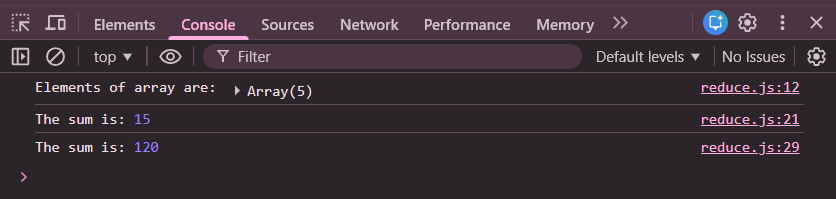

# Practice Question – Sum and Product Using reduce()

This repository contains a JavaScript program that creates an array from **1 to n** based on user input and uses the **`reduce()` method** to calculate the **sum** and **product** of all elements.  
It is intended for beginners to practice **arrays**, **loops**, **user input**, and the **reduce() method** in JavaScript.

---

## 📌 Program Overview

The program takes a number `n` as input from the user using `prompt()`.  
It then creates an array containing numbers from `1` to `n`.

Using the `reduce()` method:
- The **sum** of all numbers in the array is calculated
- The **product** of all numbers in the array is calculated

All results are displayed in the browser console.

---

## 🧪 Code Functionality

- Takes user input using `prompt()`
- Creates an array from `1` to `n` using a loop
- Displays the generated array
- Uses `reduce()` to calculate the sum of array elements
- Uses `reduce()` to calculate the product of array elements
- Prints results using `console.log()`

---

## 🧠 Concepts Covered

- User input using `prompt()`
- Arrays in JavaScript
- Array creation using loops
- `reduce()` array method
- Accumulator (`prev`) and current value (`curr`)
- Console output using `console.log()`

---

## 🖥️ Output

📸 **Taking input using `prompt()` (entering value of n):**  

📸 **Console output showing array, sum, and product:**  

---

## 📂 File Information

- `index.html` — HTML file used to run JavaScript in the browser  
- `reduce_sum_product.js` — JavaScript file containing the logic  
- `output1.png` — Screenshot of prompt input  
- `output2.png` — Screenshot of console output  
- `README.md` — Project documentation  

---

## ⚠️ Limitations
- No validation for non-numeric or negative input  
- Large input values may cause very large product results  
- Output is visible only in the browser console  

---

## 👨‍💻 Author

**Shreya Awari**  
📧 Email: shreyaawari31@gmail.com  
🌐 GitHub: https://github.com/shreyaawari28  

---

⭐ Feel free to **star the repository** if you find it useful.

