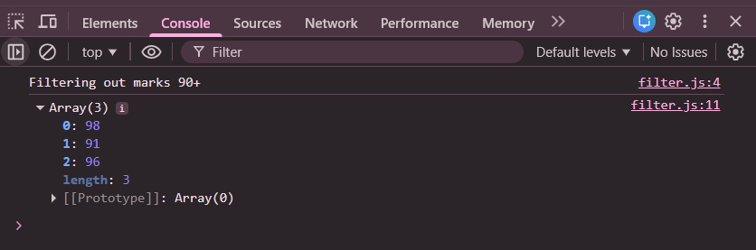

# Practice Question – forEach() Array Method

This repository contains JavaScript programs that demonstrate the use of the **`forEach()` array method**.  
It is intended for beginners to understand how to iterate over arrays and perform operations on each element.

---

## 📌 Program Overview

The program demonstrates two use cases of the `forEach()` method:

1. Printing the **square of each number** in an array  
2. Filtering and printing **student marks greater than 90** using a condition inside `forEach()`

Both examples show how `forEach()` executes a callback function for every element in an array.

---

## 🧪 Code Functionality

- Iterates over an array of numbers using `forEach()`
- Calculates and prints the square of each number
- Iterates over an array of marks
- Applies a condition inside `forEach()` to print marks greater than 90
- Displays all outputs using `console.log()`

---

## 🧠 Concepts Covered

- Arrays in JavaScript
- `forEach()` array method
- Arrow functions
- Callback functions
- Conditional logic inside loops
- Console output using `console.log()`

---

## 🖥️ Output

📸 **Output showing squares of numbers and filtered marks:**  

---

## 📂 File Information

- `index.html` — HTML file used to run JavaScript in the browser  
- `foreach_example.js` — JavaScript file containing `forEach()` examples  
- `output.png` — Screenshot of the console output  
- `README.md` — Project documentation  

---

## ⚠️ Limitations
- `forEach()` does not return a new array
- Data is hardcoded
- No user input
- Output is visible only in the browser console  

---

## 👨‍💻 Author

**Shreya Awari**  
📧 Email: shreyaawari31@gmail.com  
🌐 GitHub: https://github.com/shreyaawari28  

---

⭐ Feel free to **star the repository** if you find it useful.

