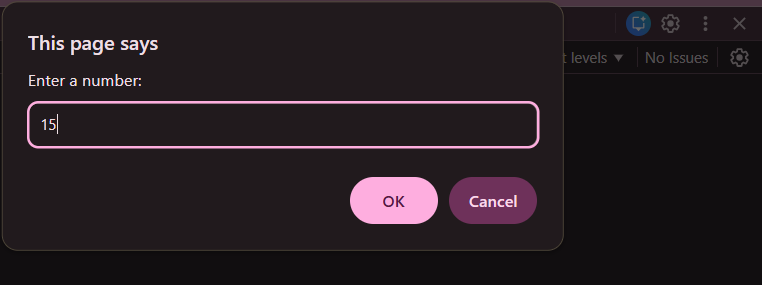
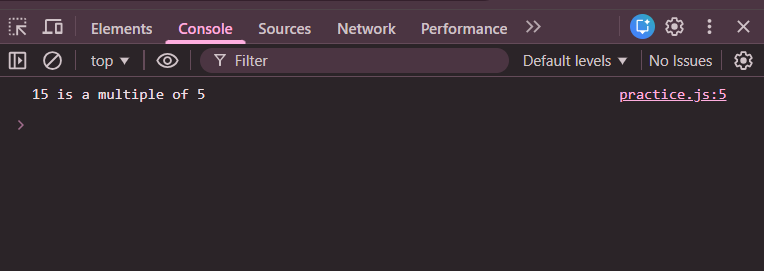

# Practice Question 1 – Check Multiple of 5

This repository contains a simple JavaScript program that checks whether a given number is a **multiple of 5** or not.  
It is intended for beginners to practice **user input**, **conditional statements**, and the **modulus operator** in JavaScript.

---

## 📌 Program Overview

The program checks whether the number entered by the user is divisible by 5.  
The input is taken using `prompt()`, and based on the condition, the output is displayed in the browser console.

---

## 🧪 Code Functionality

- Takes input from the user using `prompt()`
- Uses the modulus operator (`%`) to check divisibility by 5
- Applies an `if-else` conditional statement
- Displays the result using `console.log()`

---

## 🧠 Concepts Covered

- Taking input using `prompt()`
- Modulus operator (`%`)
- `if-else` conditional statement
- Console output using `console.log()`
- Using browser developer tools (Inspect → Console)

---

## 🚀 Live Demo

🔗 [Live Demo](https://shreyaawari28.github.io/JavaScript-Codes/Conditional_Statement/Practice_Question1/)

### How to Check the Live Demo Output
1. Open the Live Demo link.
2. Right-click on the page and select **Inspect**.
3. Open the **Console** tab.
4. A prompt will appear asking for a number.
5. Enter a number and click **OK**.
6. View the result in the console.

---

## 🖥️ Output

📸 **Taking input using `prompt()` and output when the number is a multiple of 5:**  

📸 **Taking input using `prompt()` and output when the number is not a multiple of 5:**  

---

## 📂 File Information

- `index.html` — HTML file used to run JavaScript in the browser  
- `practice1.js` — JavaScript file containing the logic  
- `output1.png` — Screenshot (multiple of 5)  
- `output2.png` — Screenshot (not a multiple of 5)  
- `README.md` — Project documentation  

---

## ⚠️ Limitations
- No validation for non-numeric input  
- No visual output on the webpage  
- Output is visible only in the browser console  

---

## 👨‍💻 Author

**Shreya Awari**  
📧 Email: shreyaawari31@gmail.com  
🌐 GitHub: https://github.com/shreyaawari28  

---

⭐ Feel free to **star the repository** if you find it useful.
