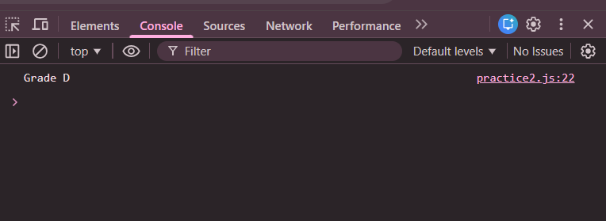

# Practice Question 2 – Student Grade Calculator

This repository contains a simple JavaScript program that assigns **grades to students based on their marks**.  
It is intended for beginners to practice **conditional statements** and **logical operators** in JavaScript.

---

## 📌 Program Overview

The program evaluates a student’s marks and assigns a grade according to the following criteria:

- 90–100 → Grade A  
- 70–89 → Grade B  
- 60–69 → Grade C  
- 50–59 → Grade D  
- 0–49 → Grade F  

The result is displayed in the browser console.

---

## 🧪 Code Functionality

- Declares a variable to store student marks
- Uses `if-else if` conditional statements to check mark ranges
- Applies logical operators (`&&`) for range checking
- Prints the corresponding grade using `console.log()`

---

## 🧠 Concepts Covered

- `if-else if` conditional ladder  
- Logical AND operator (`&&`)  
- Comparison operators  
- Decision-based output  
- Console output using `console.log()`

---

## 🖥️ Output

📸 **Output showing the grade based on marks:**  

---

## 📂 File Information

- `index.html` — HTML file used to run JavaScript in the browser  
- `grades.js` — JavaScript file containing grade logic  
- `output.png` — Screenshot of the console output  
- `README.md` — Project documentation  

---

## ⚠️ Limitations
- Marks are hardcoded (no user input)
- No validation for invalid marks
- Output is visible only in the browser console  

---

## 👨‍💻 Author

**Shreya Awari**  
📧 Email: shreyaawari31@gmail.com  
🌐 GitHub: https://github.com/shreyaawari28  

---

⭐ Feel free to **star the repository** if you find it useful.

