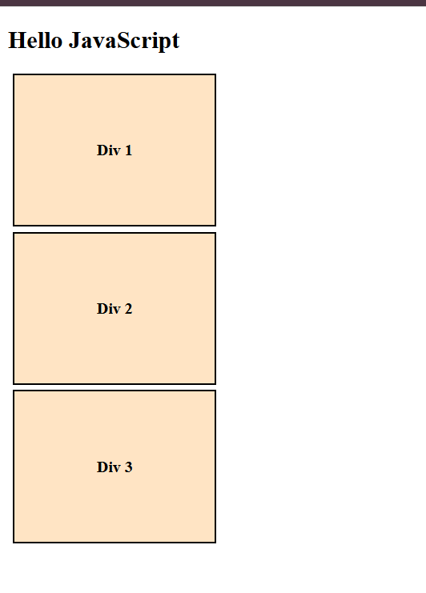
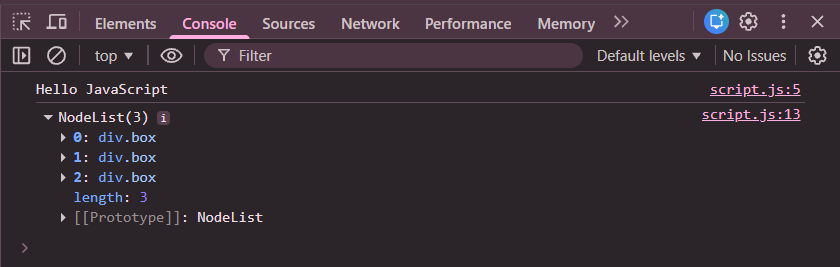

# Practice Question – DOM Manipulation (Heading & Multiple Divs)

This repository contains a JavaScript program that demonstrates **basic DOM manipulation** using JavaScript.  
It is intended for beginners to understand how JavaScript can **access and modify HTML elements dynamically**.

---

## 📌 Program Overview

The program performs two main tasks using JavaScript:

1. Updates the text of an `<h2>` heading by appending additional text using JavaScript.
2. Accesses multiple `
` elements with a common class name and assigns **unique text** to each div dynamically.

This program shows how JavaScript interacts with the **Document Object Model (DOM)** to modify webpage content after the page has loaded.

---

## 🧪 Code Functionality

- Selects an `<h2>` element using `querySelector()`
- Reads and updates the heading text using `innerText`
- Selects multiple `
` elements using `querySelectorAll()`
- Iterates over the selected divs using a `for-of` loop
- Updates each div with unique text dynamically
- Uses template literals for cleaner text formatting
- Logs DOM elements in the console using `console.dir()`

---

## 🧠 Concepts Covered

- DOM (Document Object Model)
- `querySelector()` and `querySelectorAll()`
- `innerText` property
- NodeList
- Looping through DOM elements
- Template literals
- Console inspection using DevTools

---

## 🖥️ Output

📸 **Output 1: Initial webpage before JavaScript execution**  
(Original heading and div content)
  

📸 **Output 2: Console view showing selected DOM elements**  
(NodeList of divs printed using `console.dir()`)
  

📸 **Output 3: Final webpage after JavaScript execution**  
(Updated heading text and modified div content)
  

---

## 📂 File Information

- `index.html` — HTML structure of the page  
- `style.css` — Styling for div elements  
- `script.js` — JavaScript logic for DOM manipulation  
- `output1.png` — Screenshot before DOM changes  
- `output2.png` — Screenshot of console output  
- `output3.png` — Screenshot after DOM changes  
- `README.md` — Project documentation  

---

## ⚠️ Limitations
- Content changes are static and predefined
- No user interaction
- DOM manipulation happens only on page load

---

## 👨‍💻 Author

**Shreya Awari**  
📧 Email: shreyaawari31@gmail.com  
🌐 GitHub: https://github.com/shreyaawari28  

---

⭐ Feel free to **star the repository** if you find it useful.
