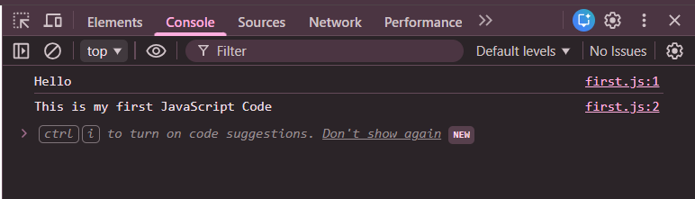

# First JS Code

## 📌 Overview
**First JS Code** is a basic JavaScript program created to understand how JavaScript works in a web browser.

In this program, I learned how to **connect an external JavaScript file with an HTML file**, how JavaScript is **executed inside the browser**, and how to **view output using the browser’s developer console**.

The project consists of a simple HTML file that loads a JavaScript file using the `` tag loads the JavaScript file  
- The JavaScript code executes automatically  
- Output is displayed in the browser console  

---

## 🖥️ Output
The output is displayed in the browser console after opening the HTML file.

📸 **Console Output Screenshot:**  

---

## ⚠️ Limitations
- No visual output on the webpage  
- No user interaction or logic  
- Output is visible only in the browser console  

---

## 👨‍💻 Author
**Shreya Awari**  
📧 Email: shreyaawari31@gmail.com  
🌐 GitHub: https://github.com/shreyaawari28  

---

⭐ Feel free to **star the repository** if you find it useful.

