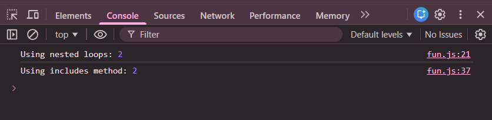

# Practice Question – Count Vowels in a String (Functions & Arrow Functions)

This repository contains a JavaScript program that counts the **number of vowels** in a given string using different function approaches.  
It is intended for beginners to understand **function declarations**, **arrow functions**, and **string processing** in JavaScript.

---

## 📌 Program Overview

The program defines multiple functions that take a string as an argument and return the total number of vowels present in the string.

Three different approaches are demonstrated:
1. Using **nested loops**
2. Using the **`includes()` method**
3. Using an **arrow function**

The output for each approach is displayed in the browser console for comparison.

---

## 🧪 Code Functionality

- Accepts a string as input
- Converts the string to lowercase
- Iterates through each character of the string
- Checks whether a character is a vowel
- Counts the total number of vowels
- Returns the final count
- Prints results for all approaches using `console.log()`

---

## 🧠 Concepts Covered

- Function declaration using the `function` keyword
- Arrow functions (`=>`)
- Function parameters and return values
- String manipulation
- `for-of` loops
- Arrays and `includes()` method
- Console output using `console.log()`

---

## 🖥️ Output

📸 **Output showing vowel count using different approaches:**  

---

## 📂 File Information

- `index.html` — HTML file used to run JavaScript in the browser  
- `vowel_count.js` — JavaScript file containing all implementations  
- `output.png` — Screenshot of the console output  
- `README.md` — Project documentation  

---

## ⚠️ Limitations
- Input string is hardcoded
- Handles only English vowels
- No user input
- Output is visible only in the browser console  

---

## 👨‍💻 Author

**Shreya Awari**  
📧 Email: shreyaawari31@gmail.com  
🌐 GitHub: https://github.com/shreyaawari28  

---

⭐ Feel free to **star the repository** if you find it useful.

