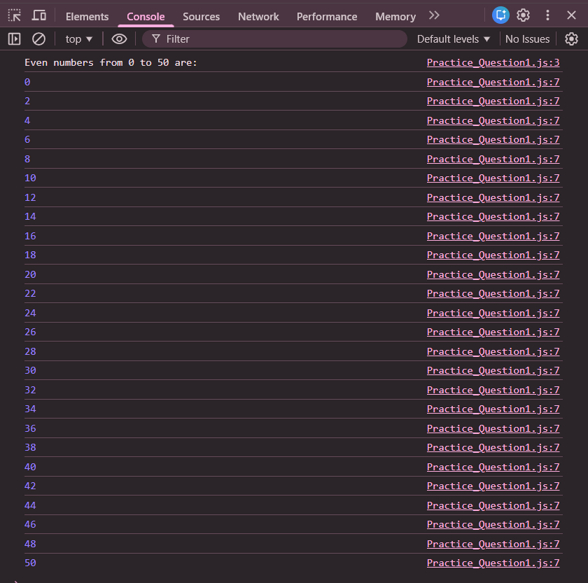

# Practice Question 3 – Print Even Numbers

This repository contains a simple JavaScript program that prints **all even numbers from 0 to 50**.  
It is intended for beginners to practice **loops**, **conditional statements**, and the **modulus operator** in JavaScript.

---

## 📌 Program Overview

The program iterates through numbers from 0 to 50 using a `for` loop and checks whether each number is even.  
If a number is even, it is printed in the browser console.

---

## 🧪 Code Functionality

- Uses a `for` loop to iterate from 0 to 50
- Checks whether a number is even using the modulus operator (`%`)
- Prints only even numbers
- Displays output using `console.log()`

---

## 🧠 Concepts Covered

- `for` loop  
- Modulus operator (`%`)  
- `if` conditional statement  
- Loop-based iteration  
- Console output using `console.log()`

---

## 🖥️ Output

📸 **Output showing even numbers from 0 to 50:**  

---

## 📂 File Information

- `index.html` — HTML file used to run JavaScript in the browser  
- `even_numbers.js` — JavaScript file containing the logic  
- `output.png` — Screenshot of the console output  
- `README.md` — Project documentation  

---

## ⚠️ Limitations
- Upper limit is fixed (50)
- No user input
- Output is visible only in the browser console  

---

## 👨‍💻 Author

**Shreya Awari**  
📧 Email: shreyaawari31@gmail.com  
🌐 GitHub: https://github.com/shreyaawari28  

---

⭐ Feel free to **star the repository** if you find it useful.

