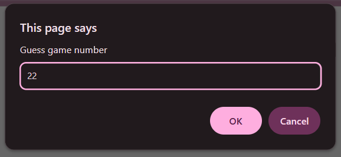
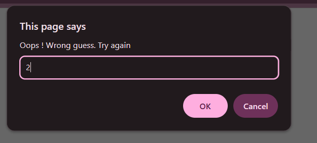

# Practice Question 4 – Number Guessing Game

This repository contains a simple JavaScript program that implements a **number guessing game**.  
It is intended for beginners to practice **loops**, **conditional statements**, and **user interaction** using JavaScript.

---

## 📌 Program Overview

The program starts with a predefined game number.  
The user is asked to guess the number using `prompt()` until the correct number is entered.

If the user enters a wrong number, the program keeps asking the user to guess again.  
Once the correct number is guessed, a success message is displayed using an alert.

---

## 🧪 Code Functionality

- Stores a fixed game number
- Takes user input using `prompt()`
- Compares user input with the game number
- Uses `if-else` to check the first guess
- Uses a `while` loop to continue until the correct guess
- Displays messages using `alert()`

---

## 🧠 Concepts Covered

- User input using `prompt()`
- Comparison operators
- `if-else` conditional statements
- `while` loop
- Boolean conditions
- Alerts for user feedback

---

## 🖥️ Output

📸 **First attempt (wrong guess):**  

📸 **Second attempt (wrong guess):**  

📸 **Correct guess (success message):**  

---

## 📂 File Information

- `index.html` — HTML file used to run JavaScript in the browser  
- `guess_game.js` — JavaScript file containing the game logic  
- `output1.png` — Screenshot of first wrong guess  
- `output2.png` — Screenshot of second wrong guess  
- `output3.png` — Screenshot of correct guess  
- `README.md` — Project documentation  

---

## ⚠️ Limitations
- Game number is fixed (not randomly generated)
- No validation for non-numeric input
- Output depends on browser prompts and alerts

---

## 👨‍💻 Author

**Shreya Awari**  
📧 Email: shreyaawari31@gmail.com  
🌐 GitHub: https://github.com/shreyaawari28  

---

⭐ Feel free to **star the repository** if you find it useful.
