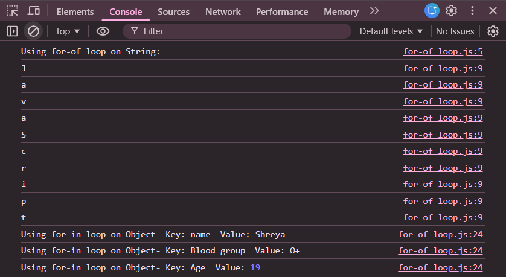

# Practice Question 5 – for-of and for-in Loops

This repository contains a simple JavaScript program that demonstrates the use of **for-of** and **for-in** loops.  
It is intended for beginners to understand how iteration works with **strings** and **objects** in JavaScript.

---

## 📌 Program Overview

The program uses a `for-of` loop to iterate over each character of a string and a `for-in` loop to iterate over the keys of an object.

Each iteration prints the current value or key-value pair to the browser console.

---

## 🧪 Code Functionality

- Declares a string and iterates over its characters using a `for-of` loop
- Prints each character of the string
- Declares an object with multiple properties
- Uses a `for-in` loop to iterate over object keys
- Prints both keys and corresponding values
- Displays all output using `console.log()`

---

## 🧠 Concepts Covered

- `for-of` loop for iterable data types (strings)
- `for-in` loop for objects
- Iteration over strings
- Iteration over object properties
- Accessing object values using bracket notation
- Console output using `console.log()`

---

## 🖥️ Output

📸 **Output showing iteration using for-of and for-in loops:**  

---

## 📂 File Information

- `index.html` — HTML file used to run JavaScript in the browser  
- `loops.js` — JavaScript file containing loop examples  
- `output.png` — Screenshot of the console output  
- `README.md` — Project documentation  

---

## ⚠️ Limitations
- No user input
- Fixed string and object values
- Output is visible only in the browser console  

---

## 👨‍💻 Author

**Shreya Awari**  
📧 Email: shreyaawari31@gmail.com  
🌐 GitHub: https://github.com/shreyaawari28  

---

⭐ Feel free to **star the repository** if you find it useful.
