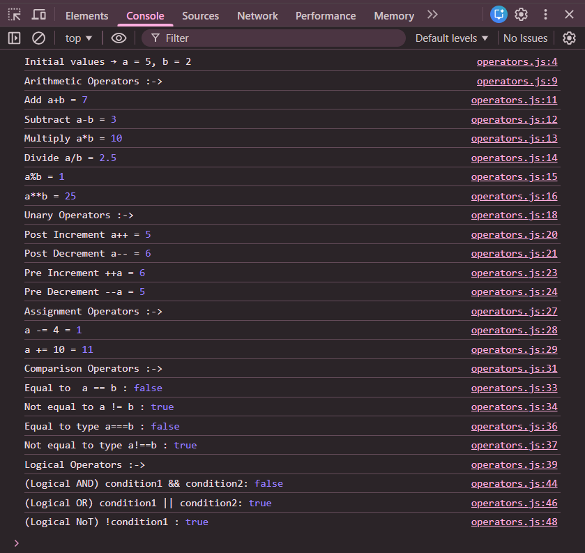

# JavaScript Operators – Example Program

This repository contains a basic JavaScript program that demonstrates the usage of **different types of operators** in JavaScript.  
It is intended for beginners who are learning JavaScript fundamentals and want to understand how operators work in real code.

---

## 📌 Program Overview

The program demonstrates the use of various JavaScript operators, including:

- Assignment operators
- Arithmetic operators
- Unary operators
- Assignment compound operators
- Comparison operators
- Logical operators

It also shows how operator results change based on **operand values** and **operator behavior**.

---

## 🧪 Code Functionality

- Declares numeric variables using `let`
- Assigns initial values using the assignment operator (`=`)
- Performs arithmetic operations such as addition, subtraction, multiplication, division, modulus, and exponentiation
- Demonstrates unary operators like pre-increment, post-increment, pre-decrement, and post-decrement
- Uses compound assignment operators (`+=`, `-=`)
- Compares values using comparison operators (`==`, `!=`, `===`, `!==`)
- Applies logical operators (`&&`, `||`, `!`) on boolean expressions
- Prints all outputs to the browser console using `console.log()`

---

## 🧠 Operators Covered

- **Assignment Operators**: `=`, `+=`, `-=`
- **Arithmetic Operators**: `+`, `-`, `*`, `/`, `%`, `**`
- **Unary Operators**: `++`, `--`
- **Comparison Operators**: `==`, `!=`, `===`, `!==`
- **Logical Operators**: `&&`, `||`, `!`

---

## 🖥️ Output

The output is displayed in the **browser console**.

📸 **Console Output Screenshot:**  

---

## 📂 File Information

- `index.html` — HTML file used to run JavaScript in the browser  
- `operators.js` — JavaScript file containing operator examples  
- `output.png` — Screenshot of the console output  
- `README.md` — Project documentation  

---

## ⚠️ Limitations
- No visual output on the webpage  
- No user interaction  
- Output is visible only in the browser console  

---

## 👨‍💻 Author

**Shreya Awari**  
📧 Email: shreyaawari31@gmail.com  
🌐 GitHub: https://github.com/shreyaawari28  

---

⭐ Feel free to **star the repository** if you find it useful.
