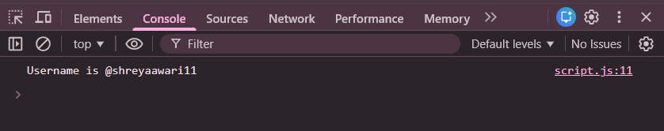

# Practice Question – Username Generator

This repository contains a simple JavaScript program that generates a **username** based on the user’s full name.  
It is intended for beginners to practice **string manipulation** and **user input handling** in JavaScript.

---

## 📌 Program Overview

The program prompts the user to enter their full name.  
Based on the input, it generates a username that:
- Starts with `@`
- Uses the full name without spaces
- Converts all characters to lowercase
- Appends the length of the name at the end

The generated username is displayed in the browser console.

---

## 🧪 Code Functionality

- Takes user input using `prompt()`
- Removes extra spaces using `trim()`
- Removes all spaces from the name
- Converts the name to lowercase
- Calculates the length of the processed name
- Generates the username in the required format
- Displays the result using `console.log()`

---

## 🧠 Concepts Covered

- User input using `prompt()`
- String methods: `trim()`, `replaceAll()`, `toLowerCase()`
- String length calculation
- Template literals
- Console output using `console.log()`

---

## 🖥️ Output

📸 **Prompt shown to the user for entering full name:**  

📸 **Generated username displayed in the console:**  

---

## 📂 File Information

- `index.html` — HTML file used to run JavaScript in the browser  
- `username.js` — JavaScript file containing the logic  
- `output1.png` — Screenshot of the prompt input  
- `output2.png` — Screenshot of the console output  
- `README.md` — Project documentation  

---

## ⚠️ Limitations
- No validation for empty input  
- Special characters are not handled  
- Output is visible only in the browser console  

---

## 👨‍💻 Author

**Shreya Awari**  
📧 Email: shreyaawari31@gmail.com  
🌐 GitHub: https://github.com/shreyaawari28  

---

⭐ Feel free to **star the repository** if you find it useful.
